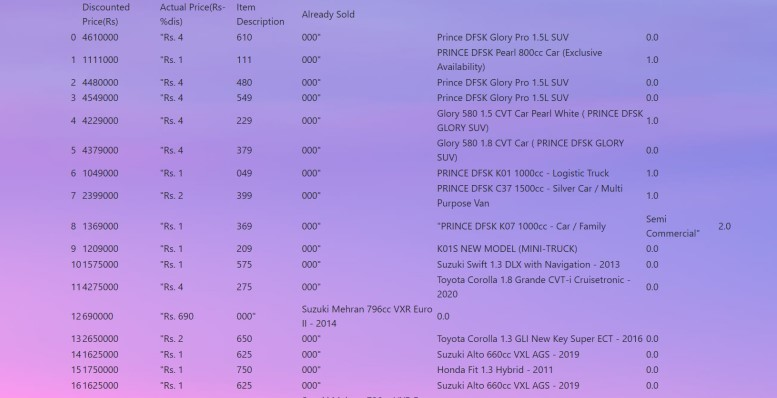

# Daraz-OLX-Analyzer
### Flask web application for product analysis of Daraz &amp; OLX

##### A web application for e-commerce sellers to search different products and check its statistics i.e. total sales, sales per listing, average rating mean, median, mode price with appropriate charts and graphs for visualizations. The project was completed using flask for backend framework and selenium for scraping websites.

### Website Interface

### Vizualization Charts (Product Location Dominance)

 
### Search History

